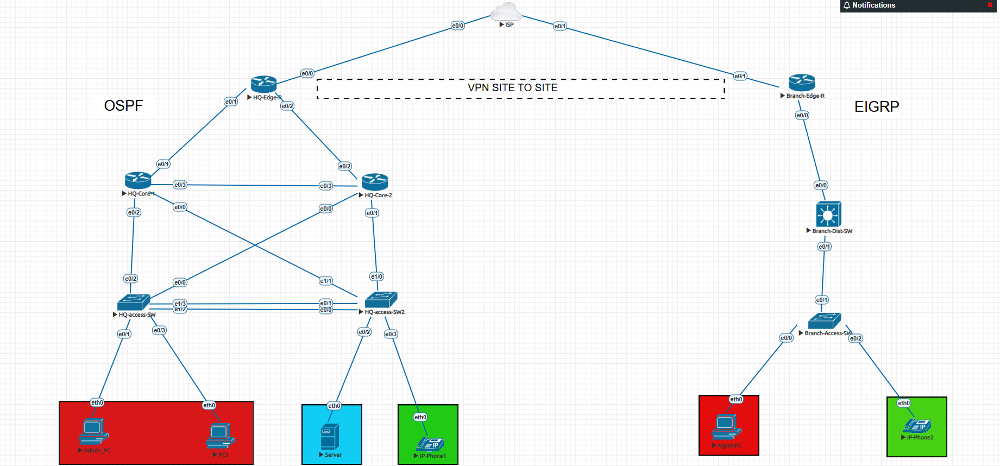
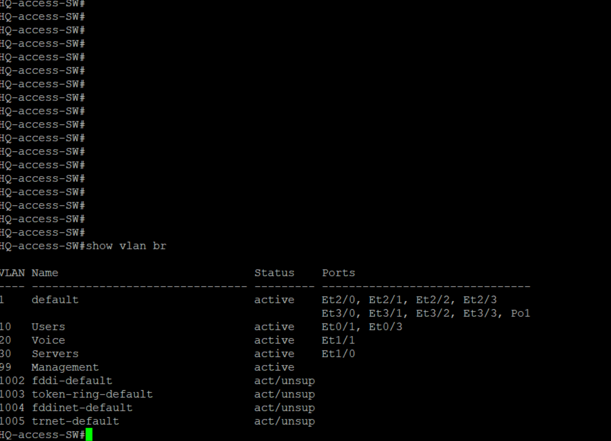
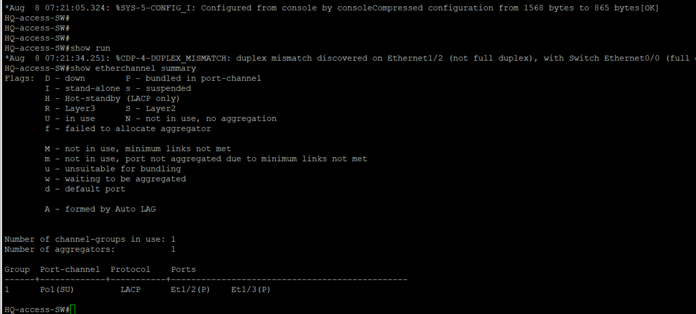
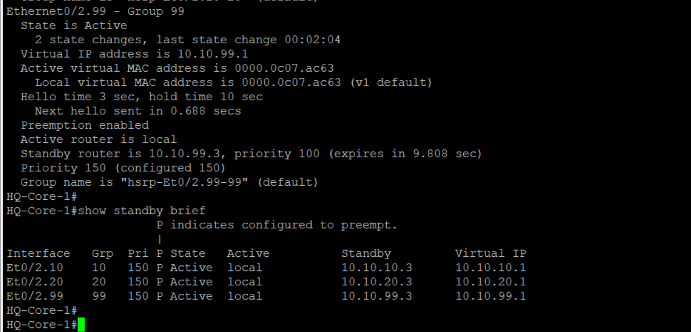

[README.md](https://github.com/user-attachments/files/30852887/README.md)
# Lab-Project — Enterprise Network Design

## Project Description

An engineering project for designing and building a complete enterprise network infrastructure — Network Infrastructure & Information Security — with a focus on logical segmentation, high performance, and data security.

## 🎯 Project Goals

* Design and build an enterprise-grade network infrastructure.
* Achieve full logical segmentation of network traffic using VLANs.
* Ensure high availability, performance, and bandwidth through redundancy and link aggregation.
* Implement dynamic routing between subnets.
* Secure inter-site connectivity using encrypted VPN.

## 1️⃣ Access Layer & Logical Segmentation (VLAN Segmentation)

**VLAN Segmentation:** Full segmentation of the network into separate VLANs for optimal traffic management:

* **Users VLAN** — separates end-user traffic.
* **Servers VLAN** — protects and isolates server resources.
* **Voice VLAN** — dedicated to VoIP traffic, with QoS priority to ensure call quality.

**Bandwidth Optimization:** Implemented **EtherChannel** using the **LACP** protocol between the HQ switches to increase bandwidth and provide redundancy in inter-switch connectivity.

## 2️⃣ Core Layer & Services Management (Layer 3 & Services)

* **Address Management (DHCP):** Configured the Layer 3 switch as a local DHCP server, with separate DHCP pools for each VLAN.
* **High Availability:** Implemented the **HSRP** protocol between the two HQ Core devices to ensure default gateway redundancy for all network users.
* **Dynamic Routing:** Used the **OSPF** and **EIGRP** protocols to distribute routes between subnets and ensure fast network convergence.

## 3️⃣ Information Security & Connectivity (Site-to-Site IPsec VPN)

* **Remote Connectivity:** Established a secure **IPsec VPN** tunnel between the HQ site and the Branch site.
* **Tunneling Process:** Implemented **IKE Phase 1** (authentication and key management) and **Phase 2** (ESP encryption) to ensure secure data transfer over public infrastructure.

## 📐 Network Topology

## 🏷️ VLAN Design

## 🖼️ Additional Screenshots

